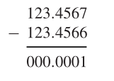

# Loss of significance

了解计算机算数细节的一个优点是我们可以在一个更好的角度去理解计算机计算的一些陷阱。以多种形式出现的一个主要问题是由于减去几乎相等的数字而导致的有效数字的丢失。假设我们将两个为七位有效数字的数字相减：

我们输入的两个相减的数字为$7$位数，最后得到的结果为$1$位数的精度。

***

例：

假设我们在只能存储三位数的计算机上进行下列运算
$$
\sqrt{9.01} - 3
$$
因为$\sqrt{9.01} \approx 3.0016662$，保留$3$位的话为$3.00$，所以我们的答案为$0.00$。但是我们可以用其他方法来避免这种情况：
$$
\begin{aligned}
\sqrt{9.01} - 3 &= \frac{(\sqrt{9.01}-3)(\sqrt{9.01}+3)}{\sqrt{9.01}+3}\\
&= \frac{9.01-3^2}{\sqrt{9.01}+3}\\
&= \frac{0.01}{3.00 + 3} = \frac{0.01}{6} = 0.0016\approx 1.67\times 10^{-3}
\end{aligned}
$$
