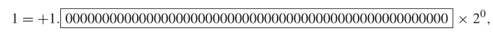
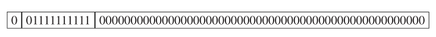
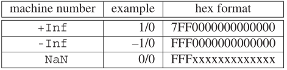
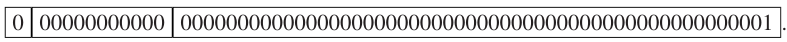
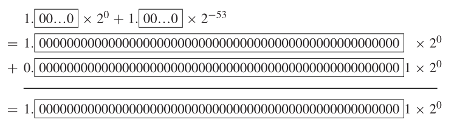

# 实数的浮点数表示方法

当使用有限精度的计算机存储单元来表示真实的、无限精度的数字时，
舍入误差是不可避免的。  

**浮点数格式**  IEEE标准由一组实数的二进制表示法组成。浮点数由三部分组成：符号($+$或$-$)、尾数(包含有效位)和指数。这三个部分一起存储在一个计算机字节中。

浮点数有三种常用的精度级别：单精度、双精度和扩展精度，也称为长
双精度。分配给三种格式的每个浮点数的位数分别为$32$、$64$和$80$。按如下
方式在各部分之间划分比特:  

| precision   | sign | exponent | mantissa |
| ----------- | ---- | -------- | -------- |
| signal      | $1$  | $8$      | $23$     |
| double      | $1$  | $11$     | $52$     |
| long double | $1$  | $15$     | $64$     |

这三种精确度的工作原理基本相同。归一化IEEE浮点数的形式为：
$$
\pm 1.bbb\cdots b\times2^p
$$
其中每个$b$为$0$或$1$，并且$p$为表示指数的一个$M$比特的二进制数。

当二进制数存储为规格化浮点数时，他是“左对齐”的，这意味着最左边的$1$正好移到基点的左边。指数的变化补偿了这种移位。例如，十进制数字$9$(二进制位$1001$)将存储为
$$
+1.001\times 2^3
$$
双精度的数字$1$为
$$
+1.0000000000000000000000000000000000000000000000000000  \times 2^{0}
$$
其中我们有$52$位尾数。比$1$大的下一个浮点数为：
$$
+1.0000000000000000000000000000000000000000000000000001  \times 2^{0}
$$
或者$1+2^{-52}$。

机器的经度(**machine epsilon**)，表示为$\epsilon_{\operatorname{match}}$，是$1$和比$1$大离$1$最近的浮点数的距离。对于IEEE双精度浮点数标准：
$$
\epsilon_{\operatorname{match}} = 2^{-52}
$$
十进制数$9.4 = (1001.\overline{0110})_2$左对齐为
$$
+1.0010110011001100110011001100110011001100110011001100110 \ldots \times 2^{3},
$$
其中我们有$52$位尾数。这就产生了新的问题：我们如何将表示$9.4$的无限二进制数放在有限的位数中？

我们必须用某种方法截断数字，但是这样做我们不可避免地会造成误差。一种方法，叫做截断(**chopping**)，简单地将超过地位数截断掉。这种方法很简单，但是它总是将结果移向$0$，这是有偏见的。

另一种方法是四舍五入(**rounding**)。以二进制表示，如果位为$1$，向上舍入。具体的说，在双精度数中看第$53$位。由IEEE标准实现的默认舍入技术是，如果$53$位是$1$，则将$1$加到位$52$上(向上舍入)，如果位$53$是$0$，则不对$52$位做任何操作(向下舍入)，但有一个例外：如果位$52$后面的位是$10000\cdots$，恰好在向上和向下的中间，我们根据那个选择使最后的位$52$等于$0$而向上舍入或向下舍入。那么$9.4$就可以表示为
$$
+1.0010110011001100110011001100110011001100110011001101 \times 2^{3}
$$
向上取整。

***

定义 0.2  用$fl(x)$表示与$x$关联的IEEE双精度浮点数，使用四舍五入到最接近的规则。

在电脑计算中，实数$x$被比特串$fl(x)$替换。我们通过从数字的结尾的右边丢弃无穷大的尾巴$.\overline{1100}\times2^{-52}\times2^3 = 0.4\times 2^{-48}$然后加上$2^{-52}\times 2^3 = 2^{-49}$来执行舍入步骤。因此
$$
\begin{aligned}
\operatorname{fl}(9.4) &= 9.4 + 2^{-49} - 0.4\times 2^{-48}\\
&= 9.4 + (1-0.8)\times2^{-49}\\
&= 9.4 + 0.2\times2^{-49}
\end{aligned}
$$
也就是说当计算机用双精度存储$9.4$的误差为$0.2\times 2^{-49}$。我们称此误差为舍入误差(**rounding error**)。

定义0.3  设$x_c$是$x$的计算版本。则
$$
\text{绝对误差} = |x_c-x|
$$
和
$$
\text{相对误差} = \frac{|x_c-x|}{|x|}
$$
**相对舍入误差**

在IEEE机器计算模型中，$\operatorname{fl}(x)$的相对舍入误差不超过机器精度的一半：
$$
\frac{|\operatorname{fl}(x)-x|}{|x|}\le \frac{1}{2}\epsilon_{\operatorname{match}}
$$

## 机器表示(Machine representation)

截至到现在，我们已经抽象地描述了一个浮点数的表示方法。以下是有关如何在计算机上实现此表示法的更多详细信息。同样的，我们将只讨论双精度的，其他精度的原理类似。

每个双精度浮点数都分配一个$8$字节的字(即$64$位)来储存它的三个部分。
$$
se_1e_2\cdots e_{11}b_1b_2\cdots b_{52}
$$
第一位存储符号，后跟表示指数的$11$位和小数点后表示尾数的$52$位。符号位$0$表示正数，$1$表示负数。表示指数的$11$位来自正二进制整数，该整数是将$2^{10}−1=1023$加到指数上，至少对于$−1022$和$1023$之间的指数。这覆盖了$e_1\cdots e_{11}$从$1$到$2046$，留下$0$和$2047$用作其他用途，我们将要稍后讨论这些。

数字$1023$被称为双精度格式的指数偏差。

> 它用于将正指数和负指数转换为正二进制数，以便存储在指数位中。
>
> 没看懂。:cry:

`Matlab`的十六进制格式只需要将$se_1e_2\cdots e_{11}b_1b_2\cdots b_{52}$的$64$位表示为$16$个连续的十六进制或以$16$位基数的数字。因此，前三个十六进制数字表示符号和指数的组合，而后$13$个十六进制数字包含尾数。

例如，数字$1$，或者：

一旦$1023$与指数相加，则其有双精度机器码：

前三个十六进制数字对应于：
$$
001111111111 = 3FF
$$
因此浮点数$1$对应的$16$进制码为$3FF0000000000000$。

> 不知道为什么要加$1023$。

那么我们回到特殊的指数值$0$和$2047$。后面的$2047$被用来表示$\infty$如果所有的尾数位都为零，如果不都为零，则表示NAN，NAN表示不是一个数字。因为$2047$用$11$个$1$表示，或者$e_1e_2\cdots e_{11} = (11111111111)_2$，`Inf`和`-Inf`的前十二位为：$011111111111$和$111111111111$，并且剩余的$52$个尾数为$0$。机器码`NaN`也以$111111111111$为开头，但是有一个非零尾数。总结为：

其中$x$表示不全都为零。

特殊指数$0$，即$e_1e_2\cdots e_{11} = (00000000000)_2$，与标准浮点数也有所不同。在这种情况下，机器码被解释为非规范化的浮点数。
$$
\pm 0.b_1b_2\cdots b_{52}\times 2^{-1022}
$$
也就是说，仅在这种情况下，最左边的位不再假定为$1$。这些非规范化的数字被称为次正规浮点数。它们将非常小的数字范围扩展了几个量级。因此，$2^{-52}\times 2^{-1022} = 2^{-1047}$是双精度中最小的可表示的数字。它的机器码为：

请务必了解可表示的最小数$2^{-1047}$和$\epsilon_{\operatorname{match}} = 2^{-52}$。许多小于$\epsilon_{\operatorname{match}}$的数字也可以被表示，即使将它们和$1$相加可能没有效果。另一方面，小于$2^{-1047}$的双精度数字不能被表示。

次正规数包括最重要的数$0$。事实上，次正规数包括两个不同的浮点数，$+0$和$-0$，在计算中被视为相同的实数。机器表示$+0$有符号位$s = 0$，指数位$e_1\cdots e_{11}=00000000000$，并且尾数为$52$个零，即$64$位都为零。$+0$的十六进制形式为$0000000000000000$。对于数字$-0$，除了符号位$s=1$外其他的位数都相同。$-0$的十六进制形式为$800000000000$。

## 浮点数的相加

机器加法包括将需要相加的两个数的小数点对其，相加，然后将结果储存为浮点数格式。加法本身可以以更高的精度(超过$52$位)完成，因为它发生在专门用于该目的的寄存器中。加法完成之后，结果必须被舍入到$52$位以便于存储为机器码。

例如，将$1$和$2^{-53}$相加：

根据舍入规则，这将会被存储为$1.\times 2^0 = 1$。因此，根据IEEE算数，$1+2^{-53}$等于$1$。注意$2^{-53}$是有此性质的最大的数字，其他比他的数字与$1$相加都会得到比$1$大的数字。

