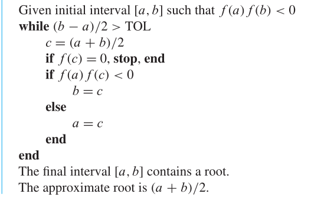

# 二分法

## Bracketing a root

括起一个根？

定义1.1  函数$f(x)$在$x=r$处有一个根(**root**)如果$f(r)=0$。解方程的第一步是确定是否有根。确保这一点的一种方法是将根括起来，在实轴上找到一个区间$[a,b]$，其中$\{f(a),f(b)\}$中的一个为正，一个为负。这可以被表达成$f(a)f(b)<0$。如果$f$是连续的，在$[a,b]$会存在根$r$使得$f(r)=0$。

定理1.2  设$f$为$[a,b]$上的连续函数，满足$f(a)f(b)<0$。则$f$在$a,b$之间存在根，也就是说，存在$r$满足$a<r<b$和$f(r)=0$。

二分法伪代码：

`Matlab`代码

~~~matlab
function xc = bisect(f, a, b, tol)
if sign(f(a)) * sign(f(b)) >= 0
    error('f(a)f(b)<0 not satisfied!')
end
fa = f(a);
fb = f(b);
while (b-a)/2 > tol
    c = (a+b)/2;
    fc = f(c);
    if fc == 0
        break
    end
    if sign(fc)*sign(fa) < 0
        b = c;
        fb = fc;
    else
        a = c;
        fa = fc;
    end
    xc = (a+b)/2;
end
~~~

我们实验一下：

~~~matlab
f = @(x) x^3 + x-1;
xc = bisect(f, 0, 1, 0.00005)
xc =

    0.6823
~~~

## How accurate and how fast

如果$[a,b]$是开始时的区间，则经过$n$次二分步骤，区间$[a_n, b_n]$的长度为$(b-a)/2^n$。选择中间点$x_c = (a_n+b_n)/2$是对$r$的最好的估计。总结一下，经过$n$次二分法，我们发现
$$
\text{Solution error} = |x_c-r| < \frac{b-a}{2^{n+1}}
$$
和
$$
\text{Function evaluations} = n+2
$$
定义1.3  如果误差小于$0.5\times10^{-p}$，则解在$p$个小数位内是正确的。

